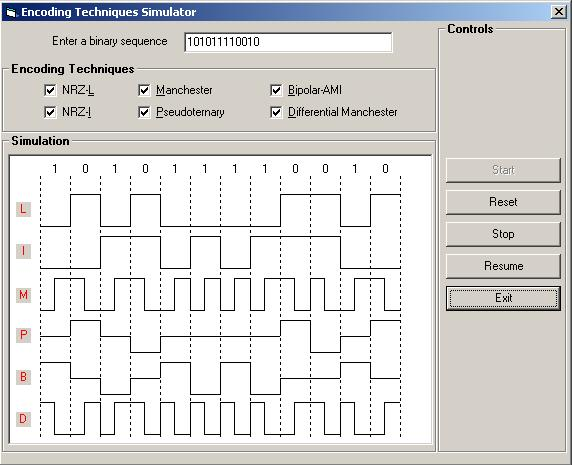



## \_\!\!\!\!\!A 6 Encoding Techniques\!\!\!\!

### Description

This program will shows the simulation of NRZ-L, NRZ-I, Manchester, Pseudoternary, Bipolar-AMI and Differential Manchester encoding techniques.

Please do Rate my Code for appreseations. Thank you
 
### More Info
 
Binary sequence of length 12 i.e. 10100 etc

             |
---                |---
**Submitted On**   |2003-10-22 12:03:36
**By**             |[Awaj](https://github.com/Planet-Source-Code/PSCIndex/blob/master/ByAuthor/awaj.md)
**Level**          |Advanced
**User Rating**    |4.7 (47 globes from 10 users)
**Compatibility**  |VB 6\.0
**Category**       |[Miscellaneous](https://github.com/Planet-Source-Code/PSCIndex/blob/master/ByCategory/miscellaneous__1-1.md)
**World**          |[Visual Basic](https://github.com/Planet-Source-Code/PSCIndex/blob/master/ByWorld/visual-basic.md)
**Archive File**   |[Encoding\_T16627810242003\.zip](https://github.com/Planet-Source-Code/awaj-a-6-encoding-techniques__1-49423/archive/master.zip)

